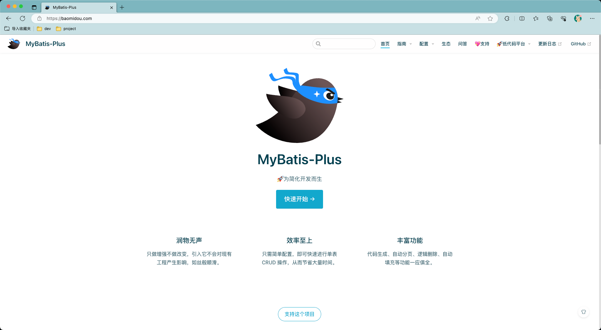
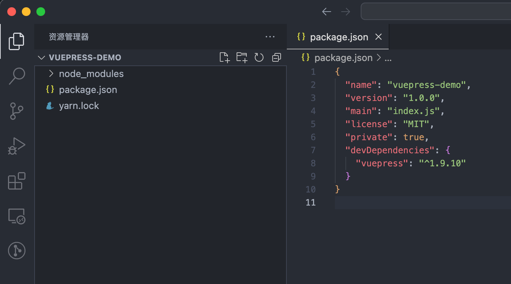
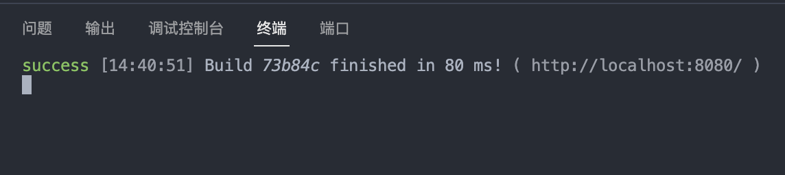
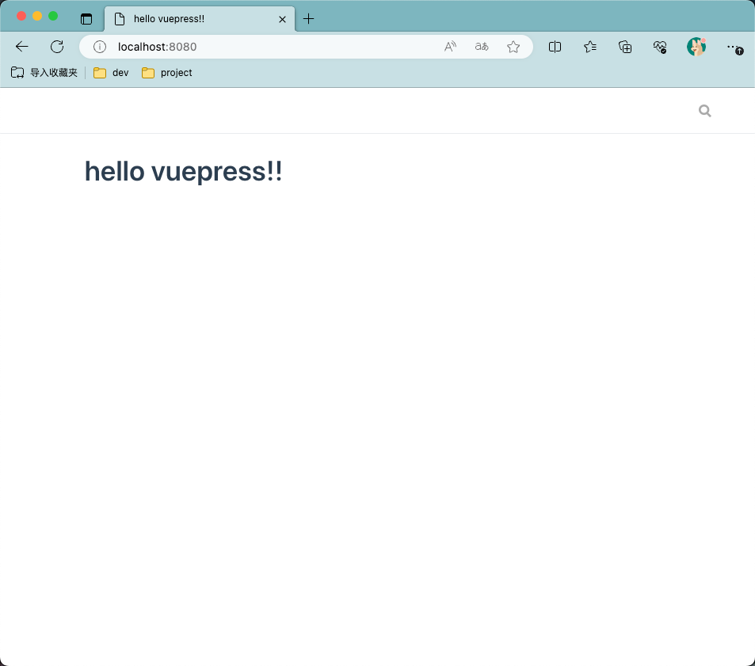

## 什么是VuePress
> VuePress 由两部分组成：第一部分是一个极简静态网站生成器 (opens new window)，它包含由 Vue 驱动的主题系统和插件 API，另一个部分是为书写技术文档而优化的默认主题，它的诞生初衷是为了支持 Vue 及其子项目的文档需求。
> 每一个由 VuePress 生成的页面都带有预渲染好的 HTML，也因此具有非常好的加载性能和搜索引擎优化（SEO）。同时，一旦页面被加载，Vue 将接管这些静态内容，并将其转换成一个完整的单页应用（SPA），其他的页面则会只在用户浏览到的时候才按需加载。
> -- [https://vuepress.vuejs.org/zh/guide/](https://vuepress.vuejs.org/zh/guide/)

说白了就是，可以把文档转化成静态网页，并且支持插件、主题。

## 能达到什么效果呢？
拿mybatis-plus官网文档举例来说，就是下边这个样子：
包含了目录，内容，功能栏目，目录等。


## 搭建一个最简单的demo
### 1、运行环境
由于vuepress是基于vue的，那就需要node.js的环境
[https://nodejs.org/zh-cn](https://nodejs.org/zh-cn) nodejs官网下载安装即可
### 2、创建本地工程

```bash
# 1、新建文件夹 
mkdir vuepress-demo && cd vuepress-demo

# 2、初始化包管理器 (如果你习惯时候用npm 可以使用 npm init)
yarn init -py

# 3、安装vuepress 
yarn add -D vuepress 
# npm安装使用命令： npm install -D vuepress

```
生成如下目录结构：


### 3、添加必备的文件
首先要在根目录下添加一个docs文件夹
然后在docs下新增一个文档 README.md
```markdown
# hello vuepress!!
```
> 在默认未改配置的情况下，docs/README.md会被自动识别编译，如果改成其他文件名，可能无法识别

### 4、下面开始配置
#### 首相配置一下启动的脚本
package.json添加脚本
```json
{
  "scripts": {
    "docs:dev": "vuepress dev docs",
    "docs:build": "vuepress build docs"
  }
}
```
添加后如下图
```bash
{
  "name": "vuepress-demo",
  "version": "1.0.0",
  "main": "index.js",
  "license": "MIT",
  "private": true,
  "devDependencies": {
    "vuepress": "^1.9.10"
  },
  "scripts": {
    "dev": "vuepress dev docs",
    "build": "vuepress build docs"
  }
}

```

添加以后就可以启动了：
启动命令：yarn dev


然后打开浏览器：[http://localhost:8080](http://localhost:8080)
就可以看到效果了：


