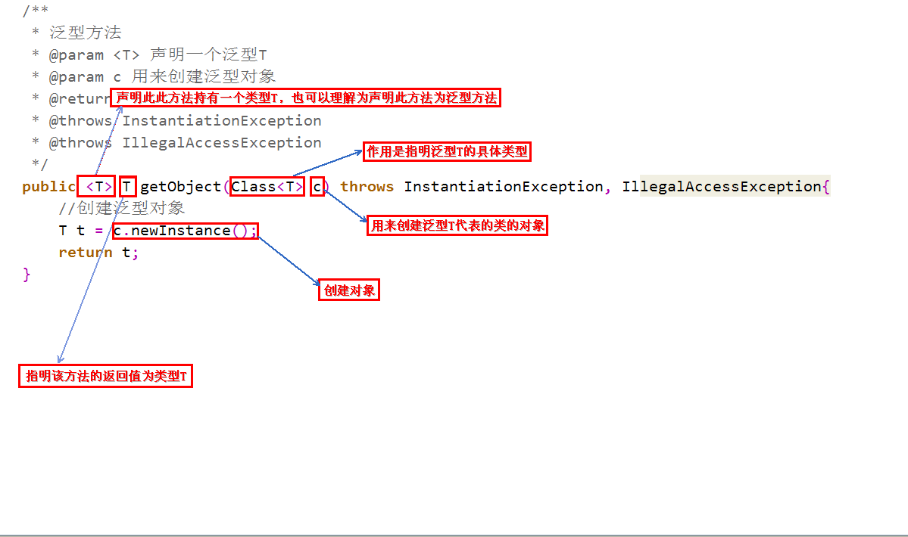
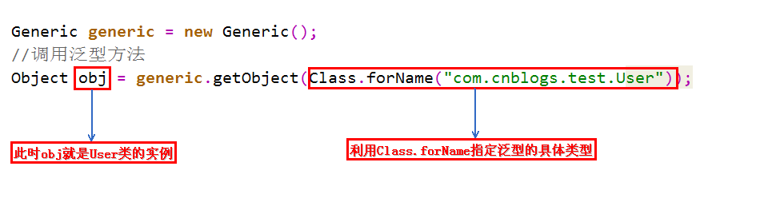

# 泛型详解

---

## 为什么会引入泛型?

> 泛型的本质是为了参数化类型（在不创建新的类型的情况下，通过泛型指定的不同类型来控制形参具体限制的类型）。也就是说在泛型使用过程中，操作的数据类型被指定为一个参数，这种参数类型可以用在类、接口和方法中，分别被称为泛型类、泛型接口、泛型方法。

**1、适用于多种数据类型执行相同的代码**（代码复用）

**2、泛型中的类型在使用时指定，不需要强制类型转换（*类型安全*，编译器会*检查类型*）**

举例说明：

1、计算器举例

```java
private static int add(int a, int b) {
    System.out.println(a + "+" + b + "=" + (a + b));
    return a + b;
}

private static float add(float a, float b) {
    System.out.println(a + "+" + b + "=" + (a + b));
    return a + b;
}

private static double add(double a, double b) {
    System.out.println(a + "+" + b + "=" + (a + b));
    return a + b;
}
```

如果没有泛型，要实现不同类型的加法，每种类型都需要重载一个add方法；通过泛型，我们可以复用为一个方法：

```java
private static <T extends Number> double add(T a, T b) {
    System.out.println(a + "+" + b + "=" + (a.doubleValue() + b.doubleValue()));
    return a.doubleValue() + b.doubleValue();
}
```

2、集合举例

```java
List list = new ArrayList();
list.add("xxString");
list.add(100d);
list.add(new Person());

//引入泛型，它将提供类型的约束，提供编译前的检查：
List<String> list = new ArrayList<String>();
```

---


## 泛型的基本使用

泛型有三种使用方式，分别为：

- 泛型类
- 泛型接口
- 泛型方法

### 泛型类

**普通泛型类**

```java
class Point<T>{         // 此处可以随便写标识符号，T是type的简称  
    private T var ;     // var的类型由T指定，即：由外部指定  
    public T getVar(){  // 返回值的类型由外部决定  
        return var ;  
    }  
    public void setVar(T var){  // 设置的类型也由外部决定  
        this.var = var ;  
    }  
}  
```

**多元泛型**

```java
class Notepad<K,V>{       // 此处指定了两个泛型类型  
    private K key ;     // 此变量的类型由外部决定  
    private V value ;   // 此变量的类型由外部决定  
    public K getKey(){  
        return this.key ;  
    }  
    public V getValue(){  
        return this.value ;  
    }  
    public void setKey(K key){  
        this.key = key ;  
    }  
    public void setValue(V value){  
        this.value = value ;  
    }  
} 
```

### 泛型接口

**简单的泛型接口**

```java
interface Info<T>{        // 在接口上定义泛型  
    public T getVar() ; // 定义抽象方法，抽象方法的返回值就是泛型类型  
}  
class InfoImpl<T> implements Info<T>{   // 定义泛型接口的子类  
    private T var ;             // 定义属性  
    public InfoImpl(T var){     // 通过构造方法设置属性内容  
        this.setVar(var) ;    
    }  
    public void setVar(T var){  
        this.var = var ;  
    }  
    public T getVar(){  
        return this.var ;  
    }  
} 
```

### 泛型方法

泛型方法，是在调用方法的时候指明泛型的具体类型。



**调用泛型方法**语法格式如下：



说明一下，定义泛型方法时，必须在返回值前边加一个`<T>`，来声明这是一个泛型方法，持有一个泛型`T`，然后才可以用泛型T作为方法的返回值。

`Class<T>`的作用就是指明泛型的具体类型，而`Class<T>`类型的变量c，可以用来创建泛型类的对象。

为什么要用变量c来创建对象呢？既然是泛型方法，就代表着我们不知道具体的类型是什么，也不知道构造方法如何，因此没有办法去new一个对象，但可以利用变量c的newInstance方法去创建对象，也就是利用反射创建对象。

泛型方法要求的参数是`Class<T>`类型，而`Class.forName()`方法的返回值也是`Class<T>`，因此可以用`Class.forName()`作为参数。其中，`forName()`方法中的参数是何种类型，返回的`Class<T>`就是何种类型。在本例中，`forName()`方法中传入的是User类的完整路径，因此返回的是`Class<User>`类型的对象，因此调用泛型方法时，变量c的类型就是`Class<User>`，因此泛型方法中的泛型T就被指明为User，因此变量obj的类型为User。

当然，泛型方法不是仅仅可以有一个参数`Class<T>`，可以根据需要添加其他参数。

**为什么要使用泛型方法呢**？因为泛型类要在实例化的时候就指明类型，如果想换一种类型，不得不重新new一次，可能不够灵活；而泛型方法可以在调用的时候指明类型，更加灵活。

---


## 泛型的上下限

**1、先看下如下的代码，很明显是会报错的** （具体错误原因请参考后文）。

```java
class A{}
class B extends A {}

// 如下两个方法不会报错
public static void funA(A a) {
    // ...          
}
public static void funB(B b) {
    funA(b);
    // ...             
}

// 如下funD方法会报错
public static void funC(List<A> listA) {
    // ...          
}
public static void funD(List<B> listB) {
    funC(listB); // Unresolved compilation problem: The method doPrint(List<A>) in the type test is not applicable for the arguments (List<B>)
    // ...             
}
```

为了解决泛型中隐含的转换问题，Java泛型加入了类型参数的上下边界机制。`<? extends A>`表示该类型参数可以是A(上边界)或者A的子类类型。编译时擦除到类型A，即用A类型代替类型参数。这种方法可以解决开始遇到的问题，编译器知道类型参数的范围，如果传入的实例类型B是在这个范围内的话允许转换，这时只要一次类型转换就可以了，运行时会把对象当做A的实例看待。

```java
public static void funC(List<? extends A> listA) {
    // ...          
}
public static void funD(List<B> listB) {
    funC(listB); // OK
    // ...             
}
```

**2、泛型上下限的引入**

在使用泛型的时候，我们可以为传入的泛型类型实参进行上下边界的限制，如：类型实参只准传入某种类型的父类或某种类型的子类。

*上限*

```java
class Info<T extends Number>{    // 此处泛型只能是数字类型
    private T var ;        // 定义泛型变量
    public void setVar(T var){
        this.var = var ;
    }
    public T getVar(){
        return this.var ;
    }
    public String toString(){    // 直接打印
        return this.var.toString() ;
    }
}
```

*下线*

```java
class Info<T>{
    private T var ;        // 定义泛型变量
    public void setVar(T var){
        this.var = var ;
    }
    public T getVar(){
        return this.var ;
    }
    public String toString(){    // 直接打印
        return this.var.toString() ;
    }
}
```

*总结*

```java
<?> 无限制通配符
<? extends E> extends 关键字声明了类型的上界，表示参数化的类型可能是所指定的类型，或者是此类型的子类
<? super E> super 关键字声明了类型的下界，表示参数化的类型可能是指定的类型，或者是此类型的父类

// 使用原则《Effictive Java》
// 为了获得最大限度的灵活性，要在表示 生产者或者消费者 的输入参数上使用通配符，使用的规则就是：生产者有上限、消费者有下限
1. 如果参数化类型表示一个 T 的生产者，使用 < ? extends T>;
2. 如果它表示一个 T 的消费者，就使用 < ? super T>；
3. 如果既是生产又是消费，那使用通配符就没什么意义了，因为你需要的是精确的参数类型。
```

*再看一个实际例子，**加深印象***

```java
private  <E extends Comparable<? super E>> E max(List<? extends E> e1) {
    if (e1 == null){
        return null;
    }
    //迭代器返回的元素属于 E 的某个子类型
    Iterator<? extends E> iterator = e1.iterator();
    E result = iterator.next();
    while (iterator.hasNext()){
        E next = iterator.next();
        if (next.compareTo(result) > 0){
            result = next;
        }
    }
    return result;
}
```

上述代码中的类型参数 E 的范围是`<E extends Comparable<? super E>>`，我们可以分步查看：

- 要进行比较，所以 E 需要是可比较的类，因此需要 `extends Comparable<…>`（注意这里不要和继承的 `extends` 搞混了，不一样）
- `Comparable< ? super E>` 要对 E 进行比较，即 E 的消费者，所以需要用 super
- 而参数 `List< ? extends E>` 表示要操作的数据是 E 的子类的列表，指定上限，这样容器才够大

**3、存在多个泛型限制** （*使用&符号*）

```java
public class Client {
    public static <T extends Staff & Passenger> void discount(T t){
        if(t.getSalary()<3000 && t.isStanding()){
            System.out.println("yes");
        }
    }
}
```

---


## Java中的泛型是伪泛型?


