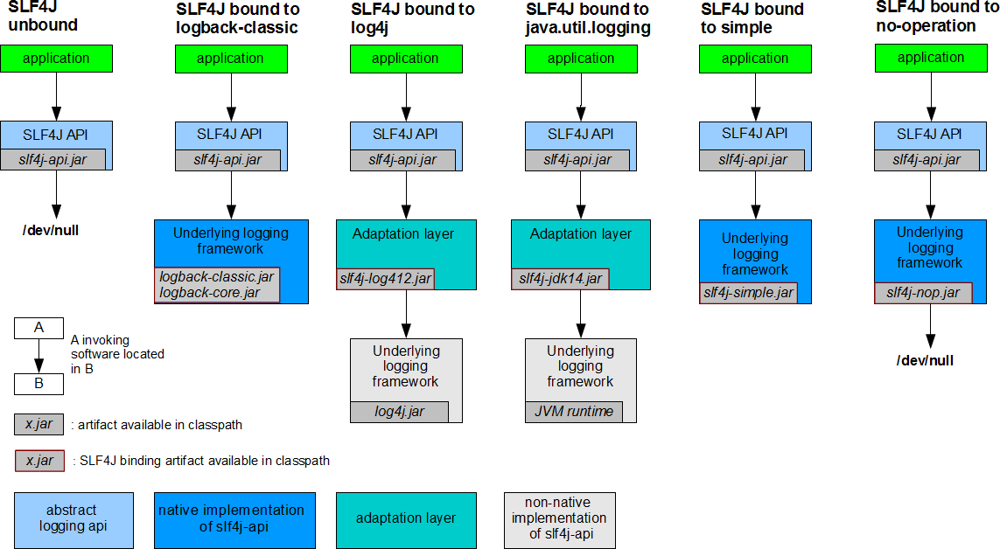
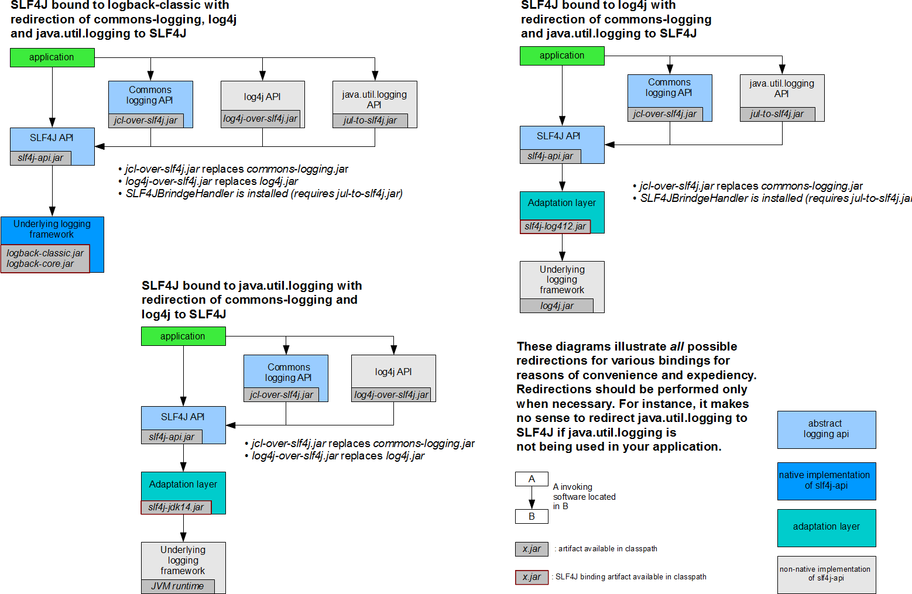

# Spring Boot统一日志框架
> 在项目开发中，日志十分的重要，不管是记录运行情况还是定位线上问题，都离不开对日志的分析。在 Java 领域里存在着多种日志框架，如 JCL、SLF4J、Jboss-logging、jUL、log4j、log4j2、logback 等等。

## 常见日志框架
市面上常见的日志框架有很多，它们可以被分为两类：日志门面（日志抽象层）和日志实现，如下表。

|日志分类|描述|举例|
|---|---|---|
|日志门面（日志抽象层）|为 Java 日志访问提供一套标准和规范的 API 框架，其主要意义在于提供接口。|JCL（Jakarta Commons Logging）、SLF4j（Simple Logging Facade for Java）、jboss-logging|
|日志实现|日志门面的具体的实现|Log4j、JUL（java.util.logging）、Log4j2、Logback|


通常情况下，日志由一个日志门面与一个日志实现组合搭建而成，Spring Boot 选用 SLF4J + Logback 的组合来搭建日志系统。  

SLF4J 是目前市面上最流行的日志门面，使用 Slf4j 可以很灵活的使用占位符进行参数占位，简化代码，拥有更好的可读性。  
  
Logback 是 Slf4j 的原生实现框架，它与 Log4j 出自一个人之手，但拥有比 log4j 更多的优点、特性和更做强的性能，现在基本都用来代替 log4j 成为主流。

 ## SLF4J 的使用
 在项目开发中，记录日志时不应该直接调用日志实现层的方法，而应该调用日志门面（日志抽象层）的方法。  
  
在使用 SLF4J 记录日志时，我们需要在应用中导入 SLF4J 及日志实现，并在记录日志时调用 SLF4J 的方法，例如：
```java
import org.slf4j.Logger;
import org.slf4j.LoggerFactory;

public class LogDemo {
    public static void main(String[] args) {
        Logger logger = LoggerFactory.getLogger(LogDemo.class);
       //调用 sl4j 的 info() 方法，而非调用 logback 的方法
        logger.info("Hello World");
    }
}
```
SLF4J 作为一款优秀的日志门面或者日志抽象层，它可以与各种日志实现框架组合使用，以达到记录日志的目的，如下图（参考自 SLF4J 官方）。



从 SLF4J 官方给出的方案可以看出：

Logback 作为 Slf4j 的原生实现框架，当应用使用 SLF4J+Logback 的组合记录日志时，只需要引入 SLF4J 和 Logback 的 Jar 包即可；
Log4j 虽然与 Logback  出自同一个人之手，但是 Log4j 出现要早于 SLF4J，因而 Log4j 没有直接实现 SLF4J，当应用使用 SLF4J+Log4j 的组合记录日志时，不但需要引入 SLF4J 和 Log4j 的 Jar 包，还必须引入它们之间的适配层（Adaptation layer）slf4j-log4j12.jar，该适配层可谓“上有老下有小”，它既要实现 SLF4J 的方法，还有调用 Log4j 的方法，以达到承上启下的作用；
当应用使用 SLF4J+JUL 记录日志时，与 SLF4J+Log4j 一样，不但需要引入 SLF4J 和 JUL 的对应的 Jar 包，还要引入适配层 slf4j-jdk14.jar。

> 这里我们需要注意一点，每一个日志的实现框架都有自己的配置文件。使用 slf4j 记录日志时，配置文件应该使用日志实现框架（例如 logback、log4j 和 JUL 等等）自己本身的配置文件。

## 统一日志框架
通常一个完整的应用下会依赖于多种不同的框架，而且它们记录日志使用的日志框架也不尽相同，例如，Spring Boot（slf4j+logback），Spring（commons-logging）、Hibernate（jboss-logging）等等。那么如何统一日志框架的使用呢？

对此，SLF4J 官方也给出了相应的解决方案，如下图。




从上图中可以看出，统一日志框架一共需要以下 3 步 ：
排除应用中的原来的日志框架；
引入替换包替换被排除的日志框架；
导入 SLF4J 实现。

SLF4J 官方给出的统一日志框架的方案是“狸猫换太子”，即使用一个替换包来替换原来的日志框架，例如 log4j-over-slf4j 替换 Log4j（Commons Logging API）、jul-to-slf4j.jar 替换 JUL（java.util.logging API）等等。

替换包内包含被替换的日志框架中的所有类，这样就可以保证应用不会报错，但替换包内部实际使用的是 SLF4J API，以达到统一日主框架的目的。

## 统一日志框架
我们在使用 Spring Boot 时，同样可能用到其他的框架，例如 Mybatis、Spring MVC、 Hibernate 等等，这些框架的底层都有自己的日志框架，此时我们也需要对日志框架进行统一。

我们知道，统一日志框架的使用一共分为 3 步，Soring Boot 作为一款优秀的开箱即用的框架，已经为用户完成了其中 2 步：引入替换包和导入 SLF4J 实现。

SpringBoot 底层使用 slf4j+logback 的方式记录日志，当我们引入了依赖了其他日志框架的第三方框架（例如 Hibernate）时，只需要把这个框架所依赖的日志框架排除，即可实现日志框架的统一，示例代码如下。

```xml
<dependency>
    <groupId>org.apache.activemq</groupId>
    <artifactId>activemq-console</artifactId>
    <version>${activemq.version}</version>
    <exclusions>
        <exclusion>
            <groupId>commons-logging</groupId>
            <artifactId>commons-logging</artifactId>
        </exclusion>
    </exclusions>
</dependency>
```